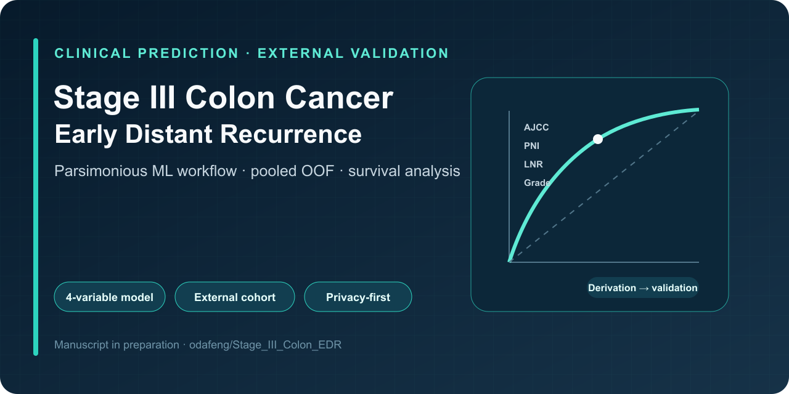

# Early Distant Recurrence Prediction in Stage III Colon Cancer

## Machine Learning Model Development and External Validation

[](#citation)
[](#which-notebooks-reproduce-the-manuscript)
[](#notes-on-reproducibility-and-privacy)
[](LICENSE)

<p align="center">
  
</p>

This repository contains the analysis workflow for developing and validating a machine learning model to predict **18-month early distant recurrence (EDR-18)** in stage III colon cancer.

| Research dimension | Implementation |
| --- | --- |
| **Primary question** | Can a parsimonious clinicopathologic model stratify 18-month distant-recurrence risk? |
| **Validation** | Nested cross-validation, pooled out-of-fold evaluation, and an independent external cohort |
| **Interpretability** | Four-variable model, calibration, Kaplan–Meier analysis, and SHAP |
| **Privacy** | Patient-level datasets are excluded; expected files and columns are documented below |

The workflow covers:
- Feature selection (LASSO and XGBoost)
- Model development with nested cross-validation
- Risk stratification and Kaplan–Meier analysis
- External validation in an independent cohort
- Peer-review revision analyses, including the harmonized pooled out-of-fold (OOF) results that appear in the current manuscript

> **⚠️ Note:**
> Raw clinical datasets are **not included** in this repository due to patient privacy.
> No `data/` directory and no example data or schema file are shipped with the repo. Users must supply their own datasets with the columns and filenames described in **[Expected Input Data](#expected-input-data)** below.

---

## Which notebooks reproduce the manuscript?

This repository has grown across two rounds of work, and the notebooks do **not** all correspond to the numbers in the current manuscript. Read this before running anything:

- **Notebooks 1–3 — original development (pre-revision).** These reproduce the *original* submission's pipeline: feature selection, model development, and the first external validation.
- **Notebooks 4–6 — revision sensitivity analyses (superseded numbers).** These were added during peer review. They report **mean-of-fold** AUCs (AUC averaged across the outer CV folds). These per-fold-averaged numbers are **not** the ones in the current manuscript and are retained only for provenance.
- **Notebooks 7–11 — reproduce the CURRENT manuscript.** These use **pooled out-of-fold (OOF)** predictions with a single harmonized decision threshold, and they **supersede notebooks 4–6**:
  - **`7.Revision_PooledOOF_Harmonization.ipynb`** — internal pooled-OOF harmonization; regenerates the main-text performance table and **Figure 2** (`Figure_2_Model_Performance.png` / `.tiff`).
  - **`8.Revision_External_Harmonization.ipynb`** — external cohort **Table 3** with **DeLong** tests.
  - **`9.Revision_External_Figures.ipynb`** — external **Figures S3** (calibration) and **S4** (risk-stratified Kaplan–Meier).
  - **`10.Revision_DFS_Figures.ipynb`** — regenerates the disease-free-survival Kaplan–Meier figures **Figure 3** (ML-risk-stratified DFS) and **Figure S2** (AJCC-substage DFS) on the finalized model.
  - **`11.Revision_SHAP_Figure4.ipynb`** — regenerates **Figure 4** (SHAP summary) for the finalized Table S2 model, computed on the uncalibrated base estimator, at ≥1200 dpi TIFF plus a vector PDF.

**In short:** for the current manuscript's tables and figures, run notebooks **7 through 11**. Notebooks 4–6 retain the earlier mean-of-fold numbers and should not be quoted as the manuscript results.

---

## Repository Structure

```text
/
├── notebooks/
│   ├── 1.LASSO_XGBoost_Feature_Selection.ipynb        # original development
│   ├── 2.XGBoost_StageIII.ipynb                        # original development
│   ├── 3.External_Validation.ipynb                     # original development
│   ├── 4.Revision_MSKCC_Variable_Comparison.ipynb      # revision (mean-of-fold; superseded)
│   ├── 5.Revision_MSI_Sensitivity.ipynb                # revision (mean-of-fold; superseded)
│   ├── 6.Revision_Broadened_Recurrence_Sensitivity.ipynb  # revision (mean-of-fold; superseded)
│   ├── 7.Revision_PooledOOF_Harmonization.ipynb        # CURRENT manuscript: table + Figure 2
│   ├── 8.Revision_External_Harmonization.ipynb         # CURRENT manuscript: Table 3 + DeLong
│   ├── 9.Revision_External_Figures.ipynb               # CURRENT manuscript: Figures S3/S4
│   ├── 10.Revision_DFS_Figures.ipynb                   # CURRENT manuscript: Figures 3 + S2 (DFS KM)
│   ├── 11.Revision_SHAP_Figure4.ipynb                  # CURRENT manuscript: Figure 4 (SHAP)
│   └── Figure_2 / 3 / 4 / S2 / S3 / S4 (.png/.tiff/.pdf) # figures written by notebooks 7, 9, 10, 11
├── model/
│   ├── final_model_calibrated.pkl                      # calibrated model pipeline
│   ├── final_feature_columns.pkl                       # ordered feature-column list
│   └── final_knn_imputer.pkl                           # fitted KNN imputer
├── app.py                                              # Streamlit demo app
├── README.md
└── requirements.txt
```

> There is **no `data/` directory in the repository.** You must create one (or a `local_data/` folder — see below) and place your own datasets in it.

---

## Notebook Overview

### 1. `1.LASSO_XGBoost_Feature_Selection.ipynb` *(original development)*

**Purpose:** Perform feature selection using LASSO logistic regression and XGBoost feature importance.

**Key steps:**
- Load the post-EDA derivation cohort (`post_EDA.parquet`).
- Fit **LASSO models** to identify sparse sets of predictors.
- Train **XGBoost models** and summarize feature importance across folds.
- Derive a parsimonious, clinically interpretable variable set and write the ML-ready derivation table (`all_cases_prepared_for_ML.parquet`).

### 2. `2.XGBoost_StageIII.ipynb` *(original development)*

**Purpose:** Develop the final four-variable model for EDR-18 prediction in stage III colon cancer.

**Key steps:**
- Load the derivation cohort (`all_cases_prepared_for_ML.parquet`).
- Implement **nested cross-validation** to tune XGBoost hyperparameters, generate out-of-fold predictions, and calibrate probabilities.
- Define a decision threshold based on the OOF Youden index.
- Construct **Kaplan–Meier curves** for all stage III patients and subgroups (e.g., AJCC stage IIIB).
- Export model artifacts to `model/` (`final_model_calibrated.pkl`, `final_feature_columns.pkl`, `final_knn_imputer.pkl`).

### 3. `3.External_Validation.ipynb` *(original development)*

**Purpose:** Apply the finalized four-variable model to an independent external cohort.

**Key steps:**
- Load the external raw table (`raw_data_EDA.csv`), prepare it, and write the external validation table with survival fields (`EDA_Ext_Val.parquet`).
- Apply the saved preprocessing and model pipeline **without retraining**.
- Evaluate ROC-AUC, Brier score, and calibration.
- Perform Cox regression for high- vs low-risk groups and generate external Kaplan–Meier curves.

### Peer-review revision analyses (notebooks 4–9)

All revision notebooks use the same modeling pipeline and `random_state = 8251 (SEED)`. Notebooks 4–11 locate data through a `find_data_dir()` helper that searches for a `local_data/` folder, and load model artifacts from `model/`.

**Superseded (mean-of-fold) sensitivity analyses:**

- **`4.Revision_MSKCC_Variable_Comparison.ipynb`** — compares the four-variable model against a conventional clinicopathologic model built on the MSKCC-nomogram variable set (DeLong test), in both cohorts.
- **`5.Revision_MSI_Sensitivity.ipynb`** — adds microsatellite instability (MSI) status to the four-variable model. Reads MSI/MMR status from `Patient_Cohort.xlsx` (sheet `Pathology`).
- **`6.Revision_Broadened_Recurrence_Sensitivity.ipynb`** — repeats the analysis under broadened outcome definitions (recurrence within 24 months; any recurrence).

**Current-manuscript notebooks (pooled-OOF; these supersede 4–6):**

- **`7.Revision_PooledOOF_Harmonization.ipynb`** — pools out-of-fold predictions across folds and applies one harmonized threshold; regenerates the main-text internal performance table and **Figure 2**.
- **`8.Revision_External_Harmonization.ipynb`** — external cohort **Table 3** with **DeLong** comparisons.
- **`9.Revision_External_Figures.ipynb`** — external **Figure S3** (calibration/performance) and **Figure S4** (risk-stratified Kaplan–Meier).
- **`10.Revision_DFS_Figures.ipynb`** — regenerates **Figure 3** (ML-risk-stratified DFS Kaplan–Meier) and **Figure S2** (DFS by AJCC substage) from the finalized model.
- **`11.Revision_SHAP_Figure4.ipynb`** — regenerates **Figure 4** (SHAP summary) for the finalized Table S2 model. SHAP is computed on the uncalibrated base XGBoost estimator; the figure is written as a ≥1200 dpi LZW TIFF and a vector PDF.

---

## Expected Input Data

No data or schema files ship with this repository. The notebooks read the following files (create a `data/` folder for notebooks 1–3, or a `local_data/` folder for notebooks 4–9, and place equivalent files there):

| File | Used by | Contents |
|------|---------|----------|
| `all_cases_prepared_for_ML.parquet` | 1 (output), 2, 4, 5, 6, 7, 8, 9, 10, 11 | ML-ready **derivation** cohort (one row per patient). |
| `post_EDA.parquet` | 1 (input) | Derivation cohort after exploratory data analysis, before final ML prep. |
| `raw_data_EDA.csv` | 3 (input) | Raw **external** cohort table. |
| `EDA_Ext_Val.parquet` | 3 (output), 9 | External validation cohort **with DFS survival fields**. |
| `data_typed_ext.csv` | 4, 5, 6, 7, 8 | Type-cast **external** cohort table. |
| `Patient_Cohort.xlsx` (sheet `Pathology`) | 5 | Pathology sheet supplying MSI/MMR/mutation status for the MSI sensitivity analysis. |

> **Filename note:** notebook 3 writes the external table as `EDA_Ext_Val.parquet` but reads it back as `../data/EDa_Ext_Val.parquet` (note the lowercase `a`). On case-sensitive filesystems these are different names — provide the file under the exact name each cell opens, or align the cells before running.

### Columns the notebooks expect

Provide a dataset whose columns match those the code references (equivalent variables under equivalent names). The key ones are:

**Four-variable model (primary predictors):**
- `AJCC_Substage` — AJCC stage III substage (e.g. `3A`, `3B`, `3C`; one-hot encoded in the notebooks)
- `PNI` — perineural invasion
- `LNR` — lymph-node ratio
- `Differentiation` — tumor differentiation grade

**Outcome labels:**
- `edr_18m` — primary binary outcome, early distant recurrence within 18 months
- `edr_24m` — early distant recurrence within 24 months (notebook 6 sensitivity analysis)
- `Recurrence` — any recurrence (notebook 6 sensitivity analysis)

**Survival fields (for Kaplan–Meier / Cox, external cohort):**
- `DFS_Months` — disease-free survival time in months
- `DFS_Events` — DFS event indicator (0/1)

**MSKCC-variable conventional model (notebooks 4 and 7/8 comparisons):**
- `Age`, `Log_CEA_PreOp`, `Tumor_Location_Group`, `LVI`, `PNI`, `Differentiation`
- `LN_Positive`, `LN_Total` (used to derive negative-node count), and `pT_Stage` (mapped to a numeric pT)

**MSI sensitivity (notebook 5):**
- `MSI_High` — microsatellite-instability-high indicator (derived from `Patient_Cohort.xlsx` pathology fields such as `MSI status`)

A derived `Risk_Group` (High/Low, from the model probability and a threshold) is computed inside the notebooks and does not need to be supplied.

---

## Environment and Installation

The analysis was developed using **Python 3.11**.

### 1. Create a virtual environment (recommended)
```bash
python -m venv .venv
source .venv/bin/activate      # On macOS/Linux
# .venv\Scripts\activate       # On Windows
```

### 2. Install dependencies
```bash
pip install -r requirements.txt
```

---

## How to Run the Notebooks

1. Create your data folder and add your datasets:
   - Notebooks **1–3** read from `../data/` (create a `data/` directory at the repo root).
   - Notebooks **4–11** search for a `local_data/` directory via `find_data_dir()`; create one and place `all_cases_prepared_for_ML.parquet`, `data_typed_ext.csv`, `EDA_Ext_Val.parquet`, and `Patient_Cohort.xlsx` there. Model artifacts are loaded from `model/`.
2. Open the notebooks in JupyterLab, Jupyter Notebook, or VS Code.
3. Run in this order, according to what you need:
   - **Original development pipeline (pre-revision results):**
     1. `1.LASSO_XGBoost_Feature_Selection.ipynb`
     2. `2.XGBoost_StageIII.ipynb`
     3. `3.External_Validation.ipynb`
   - **Revision sensitivity analyses (mean-of-fold; superseded — optional/for provenance):**
     4. `4.Revision_MSKCC_Variable_Comparison.ipynb`
     5. `5.Revision_MSI_Sensitivity.ipynb`
     6. `6.Revision_Broadened_Recurrence_Sensitivity.ipynb`
   - **Current manuscript tables and figures (run these to reproduce the paper):**
     7. `7.Revision_PooledOOF_Harmonization.ipynb` — internal table + **Figure 2**
     8. `8.Revision_External_Harmonization.ipynb` — **Table 3** + DeLong
     9. `9.Revision_External_Figures.ipynb` — **Figures S3 / S4**
     10. `10.Revision_DFS_Figures.ipynb` — **Figures 3 / S2** (DFS Kaplan–Meier)
     11. `11.Revision_SHAP_Figure4.ipynb` — **Figure 4** (SHAP)
4. Review generated figures, metrics, and model outputs. When reporting results, use the **pooled-OOF** numbers from notebooks 7–11, which supersede the mean-of-fold numbers in notebooks 4–6.

---

## Notes on Reproducibility and Privacy

- Notebook paths are relative (`../data/…`, `../model/…`) or resolved via `find_data_dir()` / `find_model_dir()`, and do not embed hospital-specific directories.
- **Raw clinical data are not included and must not be committed to this repository.**
- Revision notebooks fix `random_state = 8251` for reproducibility.
- Results may vary slightly if random seeds are changed or if library versions differ from those pinned in `requirements.txt`.

---

## Citation

If you use or adapt this workflow in your own research, please cite the corresponding manuscript (once published) and this repository.

> **Huang SF, et al.** Ruling Out Early Distant Recurrence in Stage III Colon Cancer: A Parsimonious Machine Learning Model with External Validation [Manuscript in preparation]

Machine-readable repository citation metadata are available in [`CITATION.cff`](CITATION.cff). Update the preferred citation after journal publication.
